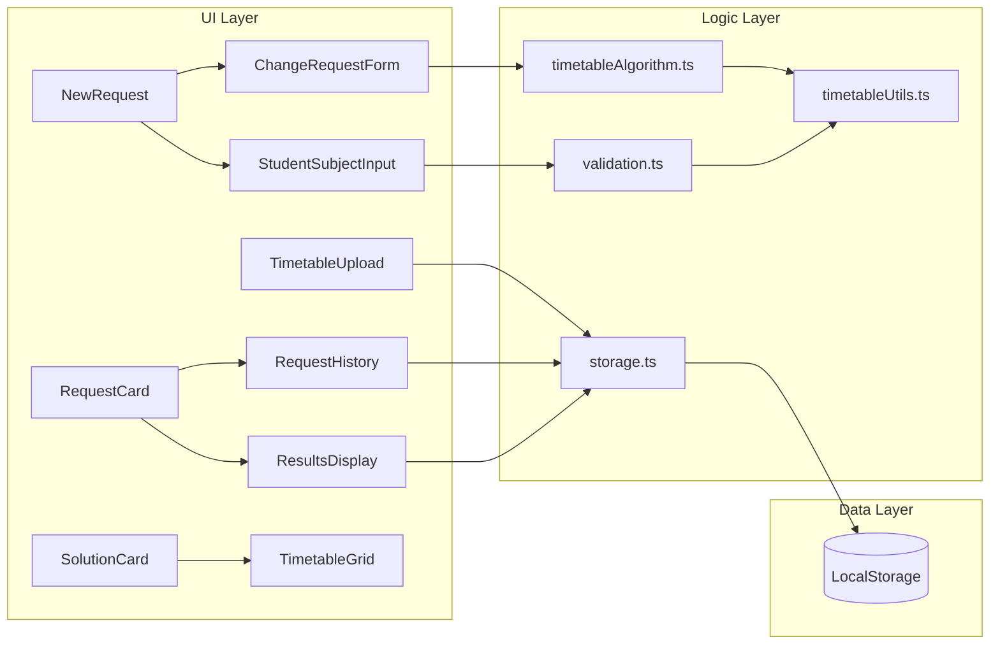

# Griddle Me This - Implementation Plan

## Architecture Overview

---

## Phase 1: Foundation ✅

### 1.1 Project Setup

- Initialize Vite + React 18 + TypeScript project
- Configure Tailwind CSS
- Install and configure shadcn/ui components
- Configure Jest with ts-jest for TypeScript support
- Set up folder structure: `src/components/`, `src/lib/`, `src/types/`, `src/__tests__/`

### 1.2 Core Types

- Create [`src/types/index.ts`](src/types/index.ts) with all TypeScript interfaces:
  - `Subject`, `TimetableData`, `ChangeRequest`, `Solution`, `ClassChange`

### 1.3 Minimal App Shell

- Create [`src/App.tsx`](src/App.tsx) with basic view structure
- Simple state-based navigation between views: Upload, NewRequest, Results, AllRequests
- Placeholder components for each view (to be replaced in later phases)

### 1.4 README Documentation

- Create [`README.md`](README.md) with build, run, and test instructions

---

## Phase 2: Core Logic with Tests (TDD) ✅

Build and test core logic together - each module with its test file.

### 2.1 Test Fixtures & Utilities

**Test fixtures** (for test setup only):

- Create [`src/__tests__/fixtures/sampleTimetable.json`](src/__tests__/fixtures/sampleTimetable.json) with sample data (118 subjects)
- Create [`src/__tests__/helpers/testHelpers.ts`](src/__tests__/helpers/testHelpers.ts):
  - `loadSampleTimetable()` - load fixture as typed array
  - `buildStudentSchedule()` - build schedule from subject codes

**Utility functions** (application code):

- Create [`src/lib/timetableUtils.ts`](src/lib/timetableUtils.ts):
  - `getLevelSubjectCode()` - extract level+subject from class code (e.g., "10ENG1" → "10ENG")
  - `findSubjectClasses()` - find all classes of a subject (e.g., all 10ENG classes)
- Create [`src/__tests__/timetableUtils.test.ts`](src/__tests__/timetableUtils.test.ts) with unit tests

### 2.2 Storage Module

- Create [`src/lib/storage.ts`](src/lib/storage.ts):
  - `saveTimetable()`, `loadTimetable()`
  - `saveRequests()`, `loadRequests()`
  - `addRequest()`, `updateRequest()`, `deleteRequest()`
  - `updateTimetableEnrollment()` for applying solutions
- Create [`src/__tests__/storage.test.ts`](src/__tests__/storage.test.ts):
  - Save and load roundtrip
  - Handle missing/corrupted data gracefully
  - Request CRUD operations
  - Enrollment update logic

### 2.3 Validation Module

- Create [`src/lib/validation.ts`](src/lib/validation.ts):
  - `validateTimetableJSON()` - check uploaded file structure
  - `validateStudentSchedule()` - ensure 6 allocations filled for both semesters, detect duplicate subjects
  - `getStudentSubjects()` - extract unique level+subject codes from schedule
- Create [`src/__tests__/validation.test.ts`](src/__tests__/validation.test.ts):
  - Valid timetable JSON structure
  - Invalid/malformed JSON rejection
  - Valid student schedule (6 allocations filled, both semesters)
  - Invalid schedule detection (missing allocations, semester conflicts)
  - Duplicate subject detection (e.g., 10ART1 and 10ART2 both enrolled)

### 2.4 Algorithm Module - State & Conflicts

- Create [`src/lib/timetableAlgorithm.ts`](src/lib/timetableAlgorithm.ts) (part 1):
  - `Conflict` type for conflict information
  - `findConflicts()` - detect allocation/semester conflicts when adding a class
  - `canAddClass()` - check if class can be added without conflicts
  - `getAlternativeClasses()` - find other classes of same subject in different allocations
  - `findNonConflictingAlternatives()` - find alternatives that fit the schedule
- Create [`src/__tests__/timetableAlgorithm.test.ts`](src/__tests__/timetableAlgorithm.test.ts):
  - Conflict detection for year-long vs semester subjects
  - Finding alternatives across allocations

### 2.5 Algorithm Module - BFS Search

- Extend [`src/lib/timetableAlgorithm.ts`](src/lib/timetableAlgorithm.ts) (part 2):
  - `findSolutions()` - main BFS implementation
  - State graph traversal with visited tracking
  - Collect all valid solutions with change paths
- Add tests:
  - Simple swap: direct placement with no conflicts
  - Single rearrangement: one subject needs to move
  - Multi-step rearrangement: chain of swaps required
  - No solution exists: all paths blocked
  - Circular dependency handling (visited states)

### 2.6 Algorithm Module - Capacity & Ranking

- Extend [`src/lib/timetableAlgorithm.ts`](src/lib/timetableAlgorithm.ts) (part 3):
  - `checkCapacity()` - account for student's own movements when checking capacity
  - `rankSolutions()` - sort by (no warnings first, then fewest changes)
- Add tests:
  - Capacity calculation with student leaving/joining
  - Leaving over-capacity class doesn't warn
  - Solutions with/without capacity warnings
  - Ranking order verification

### 2.7 Integration Tests

- Create [`src/__tests__/timetableAlgorithm.integration.test.ts`](src/__tests__/timetableAlgorithm.integration.test.ts):
  - Test full pipeline with real sample timetable data
  - Verify `findSolutions` → `checkCapacity` → `rankSolutions` flow
  - Test realistic drop/pickup scenarios

---

## Phase 3: Data Entry UI ✅

Wire up UI components to the App shell - end-to-end flow testable after this phase.

### 3.1 Timetable Upload Component

- Create [`src/components/TimetableUpload.tsx`](src/components/TimetableUpload.tsx)
- Simple file input (no drag-drop needed for MVP)
- Validate uploaded JSON using `validateTimetableJSON()`
- Display upload timestamp and subject count
- "Re-upload" button with Upload icon to replace data
- "+ Subject Change Request" button with Plus icon as primary CTA (right side)
- Persist to localStorage via storage module
- **Master Timetable Overview**: Collapsible grid showing all subjects organized by allocation and semester
  - Badges for each subject with enrollment info
  - Hover tooltips showing detailed enrollment (e.g., "23/25 enrolled")

### 3.2 Student Subject Input

- Create [`src/components/StudentSubjectInput.tsx`](src/components/StudentSubjectInput.tsx)
- Autocomplete/combobox using shadcn Popover + Command components
- Multi-select for entering all current subject codes
- Group subjects by level+subject for easier selection
- **Auto-clear search field** after each selection
- Real-time validation feedback showing which allocations are filled
- Visual 6x2 grid showing schedule coverage
- **Duplicate subject validation**: Detect when student has multiple classes of same subject (e.g., 10ART1 and 10ART2)
- Status indicator: green check when valid, red X when errors exist

### 3.3 Change Request Form

- Create [`src/components/ChangeRequestForm.tsx`](src/components/ChangeRequestForm.tsx)
- **Searchable single-select comboboxes** for both drop and pickup subjects (using Popover + Command)
- "Drop" subject dropdown: derived from student's current subjects, shows level+subject (e.g., "10HIS") with duration label
- "Pickup" subject dropdown: excludes subjects student already has, shows level+subject with duration label
- **Duration filtering**: If drop subject is semester-long, only show semester-long pickup options; if year-long, only show year-long options
- Pickup dropdown disabled until drop subject is selected; clears when drop changes
- Submit triggers algorithm and navigates to Results view

### 3.4 New Request Container

- Create [`src/components/NewRequest.tsx`](src/components/NewRequest.tsx)
- Combines StudentSubjectInput and ChangeRequestForm in one card
- Optional label input with privacy reminder at the top of the form
- Conditional rendering: show ChangeRequestForm only when schedule is valid
- **Clone support**: Accept `initialData` prop to pre-populate form fields for cloning requests

### 3.5 Wire Up App Shell

- Replace placeholder components with real ones
- Connect navigation flow: Upload → NewRequest → Results → AllRequests
- Store current request in app state for results display
- Rename "History" view to "All Requests" throughout the app

---

## Phase 4: Results UI ✅

### 4.1 Timetable Grid Component

- Create [`src/components/TimetableGrid.tsx`](src/components/TimetableGrid.tsx)
- 6 columns (AL1-AL6) x 2 rows (sem1/sem2) grid
- **Dual mode support** via `mode` prop:
  - `"current"` mode: highlights dropped (red) and outgoing rearranged (amber) subjects
  - `"new"` mode: highlights added (green) and incoming rearranged (amber) subjects
- Handle year-long subjects spanning both semester rows
- Accepts legend as a prop for flexibility

### 4.2 Change Steps Component

- Create [`src/components/ChangeSteps.tsx`](src/components/ChangeSteps.tsx)
- Numbered list of human-readable steps from `ClassChange[]`
- Icons for each step type: LogOut (drop), LogIn (enroll), ArrowRight (rearrange)
- Format: "Step 1: Move from 10ENG1 (AL3) → 10ENG3 (AL1)"
- Show capacity status indicator per affected class
- Highlight steps with capacity warnings

### 4.3 Solution Card Component

- Create [`src/components/SolutionCard.tsx`](src/components/SolutionCard.tsx)
- Expandable card using shadcn Collapsible (collapsed by default, first one expanded)
- **Side-by-side timetable display**:
  - "Current Timetable" using TimetableGrid in `"current"` mode
  - "New Timetable" using TimetableGrid in `"new"` mode
- "Recommended" badge on first solution
- Capacity warning badge if `hasCapacityWarning`
- "Accept This Solution" button (placeholder for Phase 5)

### 4.4 Alternative Suggestions Component

- Create [`src/components/AlternativeSuggestions.tsx`](src/components/AlternativeSuggestions.tsx)
- Shown when no solutions exist
- List other subjects available in same allocation as dropped subject
- Filter to show classes with available capacity first
- Show capacity status for each suggestion

### 4.5 Editable Label Component

- Create [`src/components/EditableLabel.tsx`](src/components/EditableLabel.tsx)
- Renders as span by default
- On click, transforms into Input field for in-place editing
- Saves changes on blur or Enter key press
- Used in RequestCard for editing request labels

### 4.6 Request Card Component

- Create [`src/components/RequestCard.tsx`](src/components/RequestCard.tsx)
- **Shared component** used in both RequestHistory and ResultsDisplay
- Displays:
  - Solution status icon on left: green check (has solutions) or red X (no solutions)
  - EditableLabel for in-place label editing
  - Request summary (student subjects, drop/pickup)
  - Number of solutions found
- **Action buttons with tooltips** on top right:
  - Refresh icon: "Rerun on latest data" (shown when request is outdated)
  - Copy icon: "Clone request" to create new request with same data
  - Trash icon: "Delete request"
- **Outdated badge**: Right-aligned badge shown when `timetableVersion` differs from current timetable
- **Temporary success indicator**: Shows checkmark for 2 seconds after successful rerun

### 4.7 Results Display Container

- Create [`src/components/ResultsDisplay.tsx`](src/components/ResultsDisplay.tsx)
- Uses RequestCard at the top to show request summary with all actions
- If solutions exist: map to ranked SolutionCards
- **If no solutions**: show message + AlternativeSuggestions + original timetable display
- "All Requests" button to navigate back to history

### 4.8 Request History Component

- Create [`src/components/RequestHistory.tsx`](src/components/RequestHistory.tsx)
- Title: "All Requests"
- Lists all saved requests using RequestCard component
- Click on request navigates to ResultsDisplay
- **Inline rerun**: Rerun button updates request in place without navigating, shows temporary success indicator

---

## Phase 5: Apply Solutions

### 5.1 Apply Solution Flow

- Add acceptance handler to SolutionCard
- Call `updateTimetableEnrollment()` to update localStorage counts
- Mark request status as "applied" with `appliedSolutionIndex`
- Show inline confirmation message with summary of changes applied
- Update UI state to reflect applied status (disable Accept button, show "Applied" badge)

### 5.2 Wire Up Apply Actions

- Connect "Accept This Solution" button to apply flow
- Update RequestCard to show applied state
- Prevent re-applying already applied requests

---

## Phase 6: Polish

### 6.1 Error Handling

- Error boundary component for graceful failures
- Clear error messages for validation failures
- Handle edge cases (empty timetable, no subjects match, etc.)

### 6.2 Loading & Empty States

- Loading indicators during algorithm computation (if needed)
- Empty states for: no timetable uploaded, no history, no solutions

### 6.3 Inline Feedback

- Contextual success/error messages displayed inline near the triggering action
- Status changes reflected immediately in UI state (badges, disabled buttons, visual updates)
- Confirmation dialogs for destructive actions (delete request)

### 6.4 Visual Refinements

- Consistent spacing and typography
- Ensure adequate color contrast for accessibility
- Polish transitions between views

---

## Key Files Summary

| File                                          | Purpose                                  |
| --------------------------------------------- | ---------------------------------------- |
| `README.md`                                   | Build, run, and test instructions        |
| `src/types/index.ts`                          | All TypeScript interfaces                |
| `src/lib/timetableUtils.ts`                   | Subject utility functions                |
| `src/lib/storage.ts`                          | LocalStorage CRUD operations             |
| `src/lib/validation.ts`                       | Data validation functions                |
| `src/lib/timetableAlgorithm.ts`               | BFS solution finder + capacity + ranking |
| `src/__tests__/fixtures/sampleTimetable.json` | Test fixture (118 subjects)              |
| `src/__tests__/helpers/testHelpers.ts`        | Test setup helpers                       |
| `src/__tests__/*.test.ts`                     | Unit tests                               |
| `src/__tests__/*.integration.test.ts`         | Integration tests                        |
| `src/components/TimetableUpload.tsx`          | JSON upload UI with timetable overview   |
| `src/components/StudentSubjectInput.tsx`      | Subject entry autocomplete               |
| `src/components/ChangeRequestForm.tsx`        | Drop/pickup selection with duration      |
| `src/components/NewRequest.tsx`               | Container for new request form           |
| `src/components/TimetableGrid.tsx`            | Visual schedule grid (dual mode)         |
| `src/components/ChangeSteps.tsx`              | Numbered change list                     |
| `src/components/SolutionCard.tsx`             | Single solution with dual timetables     |
| `src/components/AlternativeSuggestions.tsx`   | No-solution alternatives                 |
| `src/components/EditableLabel.tsx`            | In-place label editing                   |
| `src/components/RequestCard.tsx`              | Shared request display card              |
| `src/components/ResultsDisplay.tsx`           | Results container                        |
| `src/components/RequestHistory.tsx`           | Past requests list ("All Requests")      |
| `src/App.tsx`                                 | Main app shell and navigation            |

---

## Test File Conventions

- `*.test.ts` - Unit tests (self-contained with inline test data)
- `*.integration.test.ts` - Integration tests (use real sample data from fixtures)
