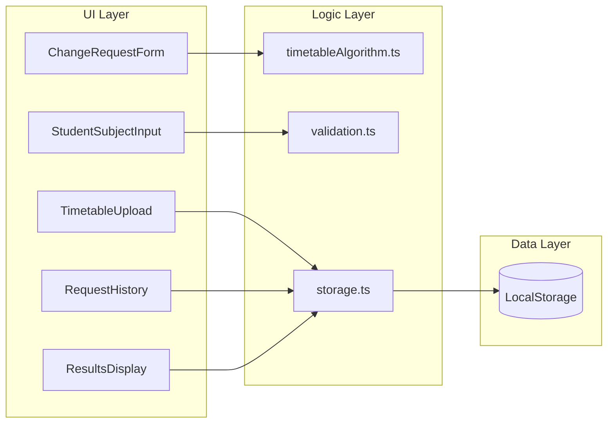

# Griddle Me This - Implementation Plan

## Architecture Overview

---

## Phase 1: Foundation

### 1.1 Project Setup

- Initialize Vite + React 18 + TypeScript project
- Configure Tailwind CSS
- Install and configure shadcn/ui components
- Configure Jest with ts-jest for TypeScript support
- Set up folder structure: `src/components/`, `src/lib/`, `src/types/`, `src/__tests__/`

### 1.2 Core Types

- Create [`src/types/index.ts`](src/types/index.ts) with all TypeScript interfaces:
  - `Subject`, `TimetableData`, `ChangeRequest`, `Solution`, `ClassChange`

### 1.3 Minimal App Shell

- Create [`src/App.tsx`](src/App.tsx) with basic view structure
- Simple state-based navigation between views: Upload, NewRequest, Results, History
- Placeholder components for each view (to be replaced in later phases)
- Allows visual progress tracking from day one

### 1.4 README Documentation

- Create [`README.md`](README.md) with:
  - Project overview and purpose
  - Prerequisites (Node.js version)
  - Installation (`npm install`)
  - Development server (`npm run dev`)
  - Running tests (`npm test`, `npm run test:watch`)
  - Building for production (`npm run build`)
  - Project structure overview

---

## Phase 2: Core Logic with Tests (TDD)

Build and test core logic together - each module with its test file.

### 2.1 Test Fixtures

- Create [`src/__tests__/fixtures/sampleTimetable.json`](src/__tests__/fixtures/sampleTimetable.json) with provided sample data (111 subjects)
- Create test helper functions for building student schedules

### 2.2 Storage Module

- Create [`src/lib/storage.ts`](src/lib/storage.ts):
  - `saveTimetable()`, `loadTimetable()`
  - `saveRequests()`, `loadRequests()`
  - `updateTimetableEnrollment()` for applying solutions
- Create [`src/__tests__/storage.test.ts`](src/__tests__/storage.test.ts):
  - Save and load roundtrip
  - Handle missing/corrupted data gracefully
  - Enrollment update logic

### 2.3 Validation Module

- Create [`src/lib/validation.ts`](src/lib/validation.ts):
  - `validateTimetableJSON()` - check uploaded file structure
  - `validateStudentSchedule()` - ensure 6 allocations filled for both semesters
  - `getStudentSubjectCodes()` - extract level+subject codes from student's classes (used by UI to filter pickup options)
- Create [`src/__tests__/validation.test.ts`](src/__tests__/validation.test.ts):
  - Valid timetable JSON structure
  - Invalid/malformed JSON rejection
  - Valid student schedule (6 allocations filled, both semesters)
  - Invalid schedule detection (missing allocations, semester conflicts)
  - Subject code extraction for filtering

### 2.4 Algorithm Module - State & Conflicts

- Create [`src/lib/timetableAlgorithm.ts`](src/lib/timetableAlgorithm.ts) (part 1):
  - `TimetableState` type representing a student's current schedule
  - `findConflicts()` - detect allocation/semester conflicts when adding a class
  - `getAlternativeClasses()` - find other classes of same subject in different allocations
- Add tests to [`src/__tests__/timetableAlgorithm.test.ts`](src/__tests__/timetableAlgorithm.test.ts):
  - Conflict detection for year-long vs semester subjects
  - Finding alternatives across allocations

### 2.5 Algorithm Module - BFS Search

- Extend [`src/lib/timetableAlgorithm.ts`](src/lib/timetableAlgorithm.ts) (part 2):
  - `findSolutions()` - main BFS implementation
  - State graph traversal with visited tracking
  - Collect all valid solutions with change paths
- Add tests:
  - Simple swap: direct placement with no conflicts
  - Single rearrangement: one subject needs to move
  - Multi-step rearrangement: chain of swaps required
  - No solution exists: all paths blocked
  - Circular dependency handling (visited states)

### 2.6 Algorithm Module - Capacity & Ranking

- Extend [`src/lib/timetableAlgorithm.ts`](src/lib/timetableAlgorithm.ts) (part 3):
  - `checkCapacity()` - account for student's own movements
  - `rankSolutions()` - sort by (no warnings first, then fewest changes)
- Add tests:
  - Capacity calculation with student leaving/joining
  - Solutions with/without capacity warnings
  - Ranking order verification

---

## Phase 3: Data Entry UI

Wire up UI components to the App shell - end-to-end flow testable after this phase.

### 3.1 Timetable Upload Component

- Create [`src/components/TimetableUpload.tsx`](src/components/TimetableUpload.tsx)
- Simple file input (no drag-drop needed for MVP)
- Validate uploaded JSON using `validateTimetableJSON()`
- Display upload timestamp
- "Re-upload" button to replace data
- Persist to localStorage via storage module

### 3.2 Student Subject Input

- Create [`src/components/StudentSubjectInput.tsx`](src/components/StudentSubjectInput.tsx)
- Autocomplete/combobox populated from timetable data (use shadcn Combobox)
- Multi-select for entering all current subject codes
- Real-time validation feedback showing which allocations are filled
- Visual indicator when valid schedule is complete (all 6 allocations, both semesters)

### 3.3 Change Request Form

- Create [`src/components/ChangeRequestForm.tsx`](src/components/ChangeRequestForm.tsx)
- Dropdown for "Drop" subject (derived from student's current subjects, shows level+subject like "10HIS")
- Dropdown for "Pickup" subject (excludes subjects student already has enrolled - prevents invalid selections at UI level)
- Optional label input with privacy reminder text
- Submit triggers algorithm and navigates to Results view

### 3.4 Wire Up App Shell

- Replace placeholder components with real ones
- Connect navigation flow: Upload → NewRequest → Results
- Store current request in app state for results display

---

## Phase 4: Results UI

### 4.1 Timetable Grid Component

- Create [`src/components/TimetableGrid.tsx`](src/components/TimetableGrid.tsx)
- 6 columns (AL1-AL6) x 2 rows (sem1/sem2) grid
- Color-code cells: unchanged, dropped (red), added (green), rearranged (yellow)
- Handle year-long subjects spanning both semester rows

### 4.2 Change Steps Component

- Create [`src/components/ChangeSteps.tsx`](src/components/ChangeSteps.tsx)
- Numbered list of human-readable steps from `ClassChange[]`
- Format: "Step 1: Move from 10ENG1 (AL3) → 10ENG3 (AL1)"
- Show capacity status indicator per affected class

### 4.3 Solution Card Component

- Create [`src/components/SolutionCard.tsx`](src/components/SolutionCard.tsx)
- Expandable card (collapsed by default, first one expanded)
- Contains TimetableGrid + ChangeSteps
- Capacity warning badge if `hasCapacityWarning`
- "Accept" button to apply solution

### 4.4 Alternative Suggestions Component

- Create [`src/components/AlternativeSuggestions.tsx`](src/components/AlternativeSuggestions.tsx)
- Shown when no solutions exist
- List other subjects available in same allocation as dropped subject
- Filter to classes with available capacity

### 4.5 Results Display Container

- Create [`src/components/ResultsDisplay.tsx`](src/components/ResultsDisplay.tsx)
- If solutions exist: map to ranked SolutionCards
- If no solutions: show message + AlternativeSuggestions
- "Save for Later" button to save request without applying

---

## Phase 5: History & Apply

### 5.1 Apply Solution Flow

- Add acceptance handler to SolutionCard
- Call `updateTimetableEnrollment()` to update localStorage counts
- Mark request status as "applied" with `appliedSolutionIndex`
- Show inline confirmation message with summary of changes applied
- Update UI state to reflect applied status (disable Accept button, show "Applied" badge)

### 5.2 Request History Component

- Create [`src/components/RequestHistory.tsx`](src/components/RequestHistory.tsx)
- List all saved requests showing:
  - Optional label
  - Current subjects summary
  - Drop/pickup info
  - Status badge: Pending | Applied
  - Stale data warning if `timetableVersion !== current uploadedAt`
- Actions per request:
  - View results (navigate to Results with stored solutions)
  - Rerun (regenerate solutions with current timetable)
  - Delete

### 5.3 Wire Up History View

- Add History view to App shell navigation
- Connect "View History" from main screen
- Handle stale data rerun flow

---

## Phase 6: Polish

### 6.1 Error Handling

- Error boundary component for graceful failures
- Clear error messages for validation failures
- Handle edge cases (empty timetable, no subjects match, etc.)

### 6.2 Loading & Empty States

- Loading indicators during algorithm computation (if needed)
- Empty states for: no timetable uploaded, no history, no solutions

### 6.3 Inline Feedback

- Contextual success/error messages displayed inline near the triggering action
- Status changes reflected immediately in UI state (badges, disabled buttons, visual updates)
- Confirmation dialogs for destructive actions (delete request)

### 6.4 Visual Refinements

- Consistent spacing and typography
- Ensure adequate color contrast for accessibility
- Polish transitions between views

---

## Key Files Summary

| File | Purpose |
|------|---------|
| `README.md` | Build, run, and test instructions |
| `src/types/index.ts` | All TypeScript interfaces |
| `src/lib/storage.ts` | LocalStorage CRUD operations |
| `src/lib/validation.ts` | Data validation functions |
| `src/lib/timetableAlgorithm.ts` | BFS solution finder |
| `src/__tests__/fixtures/sampleTimetable.json` | Test fixture (111 subjects) |
| `src/__tests__/storage.test.ts` | Storage unit tests |
| `src/__tests__/validation.test.ts` | Validation unit tests |
| `src/__tests__/timetableAlgorithm.test.ts` | Algorithm unit tests |
| `src/components/TimetableUpload.tsx` | JSON upload UI |
| `src/components/StudentSubjectInput.tsx` | Subject entry autocomplete |
| `src/components/ChangeRequestForm.tsx` | Drop/pickup selection |
| `src/components/TimetableGrid.tsx` | Visual schedule grid |
| `src/components/ChangeSteps.tsx` | Numbered change list |
| `src/components/SolutionCard.tsx` | Single solution display |
| `src/components/AlternativeSuggestions.tsx` | No-solution alternatives |
| `src/components/ResultsDisplay.tsx` | Results container |
| `src/components/RequestHistory.tsx` | Past requests list |
| `src/App.tsx` | Main app shell and navigation |
