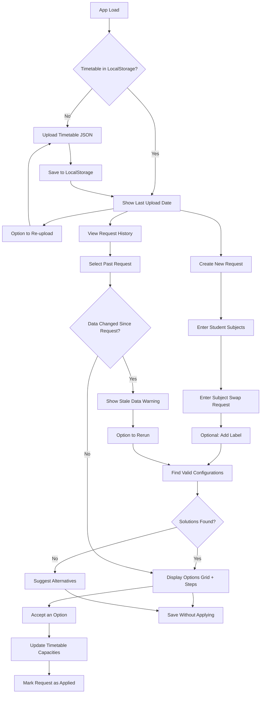

# Griddle Me This - Specification Document

## Overview

A frontend-only React web application for teachers to check whether a student's requested subject change can be accommodated within the school timetable. The app finds all valid timetable configurations (potentially involving multiple class swaps) and presents them ranked by feasibility.

---

## Core Concepts

### Timetable Structure

- **6 Allocation Blocks**: AL1 through AL6
- **2 Semesters**: Semester 1 (sem1) and Semester 2 (sem2)
- A valid student timetable fills all 6 allocation blocks for both semesters
- **Year-long subjects** (`semester: "both"`) occupy one allocation block for the entire year
- **Semester subjects** (`semester: "sem1"` or `"sem2"`) occupy one allocation block for one semester only; two different semester subjects can share an allocation block if one is sem1 and the other is sem2

### Subject Data Format (JSON)

```json
{
  "allocation": "AL6",
  "code": "11HIM6",
  "level": 11,
  "subject": "HIM",
  "class": 6,
  "semester": "both",
  "enrolled": 23,
  "capacity": 25
}
```

- `code`: Format is `{level}{subject}{class}` (e.g., `10ENG1`)
- `semester`: `"sem1"`, `"sem2"`, or `"both"`
- `enrolled`: Current number of students (used for capacity checks)
- `capacity`: Maximum class size

---

## User Flow



---

## Features

### 1. Timetable Data Management

- Upload master timetable as JSON file (array of subject objects)
- Persist to browser localStorage with upload timestamp
- Display last upload date/time prominently
- Allow re-uploading to update data at any time

### 2. Request History

- Maintain a list of all change requests in localStorage
- Each request shows:
  - Optional label (with privacy reminder: "Do not include identifying student information")
  - Current student subjects
  - Requested change (drop X for Y)
  - Status: **Pending** | **Applied**
  - **Stale data warning** if timetable was updated after the request was created
- Actions available:
  - View results
  - Rerun (regenerate solutions with current timetable data)
  - Delete request

### 3. Student Subject Entry

- Autocomplete text input populated from uploaded timetable
- Teacher enters all current subject codes for the student (e.g., `10ENG1`, `10MTG2`, `11HIM3`)
- Validate that entered subjects form a valid timetable (all 6 allocations filled for both semesters)
- Optional: Add a label for the student (with privacy reminder)

### 4. Subject Change Request

- **Drop**: Select which subject (level + 3-letter code) the student wants to drop
- **Pick up**: Select which subject (level + 3-letter code) the student wants to add
- Example: Drop `10HIS` (Year 10 History), Pick up `11HIM` (Year 11 Ancient History)

### 5. Timetabling Algorithm

The core algorithm finds all valid timetable configurations where:

1. The student ends up with the desired new subject
2. All 6 allocation blocks remain filled for both semesters
3. Other subjects may be swapped to different classes (same subject, different allocation) to make room

**Capacity Handling:**

- When calculating if a class has room, account for the student's own movements:
  - If student is leaving a class, that frees 1 spot
  - If student is joining a class, that uses 1 spot
- Classes at or exceeding capacity are valid but shown with warnings

**Ranking criteria (in order of priority):**

1. **Primary: No capacity exceeded** - solutions where all target classes have room
2. **Secondary: Fewest total changes** - simpler rearrangements preferred
3. Options exceeding capacity shown with warning indicator, listed after non-exceeding options

### 6. Results Display

**When solutions exist:**

- Visual grid showing AL1-AL6 columns x sem1/sem2 rows
- Highlight changes from original timetable (color-coded)
- List of change steps for teachers to execute:
  - "Step 1: Move from 10ENG1 (AL3) → 10ENG3 (AL1)"
  - "Step 2: Enroll in 11LIT2 (AL3)"
- Capacity status for each affected class
- Multiple options shown as expandable cards, ranked by feasibility
- **Accept button** for each option to apply the change

**When accepting a solution:**

- Update localStorage timetable data with new enrollment counts
- Mark the request as "Applied" in history
- Show confirmation of changes made

**When no solution exists:**

- Message explaining the change is not possible
- Suggest alternative subjects available in the same allocation block as the subject being dropped

---

## Technical Architecture

### Tech Stack

- **React 18+** with TypeScript
- **Tailwind CSS** for styling
- **shadcn/ui** component library
- **Vite** as build tool

### Key Components

```
src/
├── components/
│   ├── TimetableUpload.tsx       # JSON file upload with timestamp display
│   ├── RequestHistory.tsx        # List of past requests with status
│   ├── StudentSubjectInput.tsx   # Autocomplete multi-select for current subjects
│   ├── ChangeRequestForm.tsx     # Drop/pickup subject selection + label
│   ├── ResultsDisplay.tsx        # Container for results
│   ├── TimetableGrid.tsx         # Visual AL x Semester grid
│   ├── ChangeSteps.tsx           # Numbered list of required changes
│   ├── SolutionCard.tsx          # Single solution with accept button
│   └── AlternativeSuggestions.tsx
├── lib/
│   ├── timetableAlgorithm.ts     # BFS solver, capacity checking, ranking
│   ├── timetableUtils.ts         # Subject utility functions
│   ├── validation.ts             # Timetable validity checks
│   └── storage.ts                # LocalStorage helpers
├── types/
│   └── index.ts                  # TypeScript interfaces
├── __tests__/
│   ├── fixtures/                 # Test data (sample timetable JSON)
│   ├── helpers/                  # Test setup utilities
│   ├── *.test.ts                 # Unit tests
│   └── *.integration.test.ts     # Integration tests
└── App.tsx
```

### Data Types

```typescript
interface Subject {
  allocation: string;  // "AL1" - "AL6"
  code: string;        // "10ENG1"
  level: number;
  subject: string;     // 3-letter code, e.g., "ENG"
  class: number;
  semester: "sem1" | "sem2" | "both";
  enrolled: number;
  capacity: number;
}

interface TimetableData {
  subjects: Subject[];
  uploadedAt: string;  // ISO timestamp
}

interface ChangeRequest {
  id: string;
  label?: string;                      // Optional, user-provided
  studentSubjects: string[];           // Current subject codes
  dropSubject: string;                 // Level + subject code, e.g., "10HIS"
  pickupSubject: string;               // Level + subject code, e.g., "11HIM"
  createdAt: string;                   // ISO timestamp
  timetableVersion: string;            // uploadedAt of timetable used
  status: "pending" | "applied";
  appliedSolutionIndex?: number;       // Which solution was accepted
}

interface Solution {
  newTimetable: Subject[];             // Student's new subject list
  changes: ClassChange[];              // Steps to execute
  hasCapacityWarning: boolean;
  capacityWarnings: string[];          // Which classes exceed capacity
}

interface ClassChange {
  type: "rearrange" | "drop" | "enroll";
  fromClass?: Subject;                 // For rearrange/drop
  toClass?: Subject;                   // For rearrange/enroll
  description: string;                 // Human-readable step
}
```

---

## Algorithm Approach

### Selected: BFS (Breadth-First Search) on State Graph

The algorithm models the problem as a graph search:

1. **State**: A student's complete timetable configuration (set of enrolled classes)
2. **Initial state**: Current student timetable with dropped subject removed
3. **Goal state**: Valid timetable containing the desired new subject
4. **Transitions**: Swap a subject to a different class (same subject, different allocation)

**Why BFS?**

- Guarantees finding solutions with fewest changes first (optimal for "simplest rearrangement")
- Naturally explores all possibilities level by level
- Easy to implement and reason about
- Problem size is small enough that performance is not a concern

**Algorithm Steps:**

1. **Initialize**: Remove dropped subject from student's timetable
2. **Find target classes**: All classes of the pickup subject (level + code)
3. **BFS exploration**:
   - Queue starts with (current timetable, target class to add)
   - For each state, try to place the target class
   - If placement conflicts, generate new states by swapping the conflicting subject to alternative classes
   - Track visited states to avoid cycles
   - Track path (changes made) to reach each state
4. **Collect solutions**: All valid final states where target subject is placed and timetable is complete
5. **Rank**: Sort by (has capacity warning ASC, number of changes ASC)

**Alternatives Considered:**

| Approach | Why Not Selected |
|----------|------------------|
| Brute Force | Exponential complexity, unnecessary |
| Backtracking/DFS | Doesn't guarantee shortest path first |
| SAT Solver | Overkill, adds external dependency |

---

## Edge Cases

| Scenario | Handling |
|----------|----------|
| Target subject has no available classes | Show "not possible" + alternatives from same allocation |
| All target classes exceed capacity | Show all options with warnings (still valid) |
| Circular dependency in swaps | BFS visited-state tracking prevents infinite loops |
| Student enters invalid subject code | Autocomplete prevents; validation error on submit |
| Uploaded JSON malformed | Show clear error message, don't save to storage |
| Subject only offered in one semester but student needs both | Algorithm respects semester constraints |
| Request run on old timetable data | Show "stale data" warning, offer rerun option |
| Student already has the pickup subject | Show error: "Student already enrolled in this subject" |

---

## Future Enhancements (Out of MVP Scope)

- Change to different class of same subject (avoid specific teacher)
- Support for multiple year levels beyond Year 10
- Bulk check multiple students at once
- Export results to PDF/CSV
- Undo applied changes
