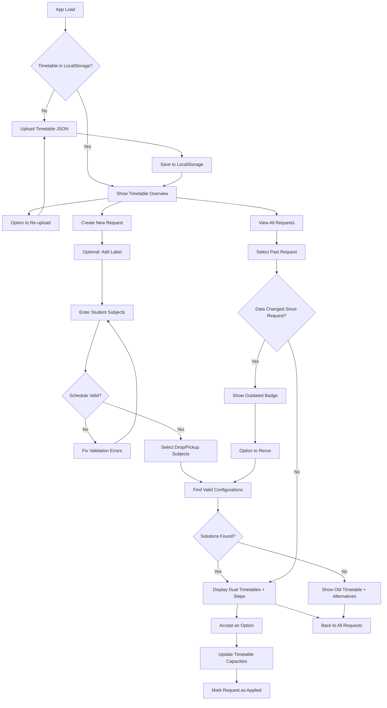

# Griddle Me This - Specification Document

## Overview

A frontend-only React web application for teachers to check whether a student's requested subject change can be accommodated within the school timetable. The app finds all valid timetable configurations (potentially involving multiple class swaps) and presents them ranked by feasibility.

---

## Core Concepts

### Timetable Structure

- **6 Allocation Blocks**: AL1 through AL6
- **2 Semesters**: Semester 1 (sem1) and Semester 2 (sem2)
- A valid student timetable fills all 6 allocation blocks for both semesters
- **Year-long subjects** (`semester: "both"`) occupy one allocation block for the entire year
- **Semester subjects** (`semester: "sem1"` or `"sem2"`) occupy one allocation block for one semester only; two different semester subjects can share an allocation block if one is sem1 and the other is sem2

### Subject Data Format (JSON)

```json
{
  "allocation": "AL6",
  "code": "11HIM6",
  "level": 11,
  "subject": "HIM",
  "class": 6,
  "semester": "both",
  "enrolled": 23,
  "capacity": 25
}
```

- `code`: Format is `{level}{subject}{class}` (e.g., `10ENG1`)
- `semester`: `"sem1"`, `"sem2"`, or `"both"`
- `enrolled`: Current number of students (used for capacity checks)
- `capacity`: Maximum class size

---

## User Flow



---

## Features

### 1. Timetable Data Management

- Upload master timetable as JSON file (array of subject objects)
- Persist to browser localStorage with upload timestamp
- Display last upload date/time and subject count
- Allow re-uploading to update data at any time
- **Master Timetable Overview**: Collapsible grid showing all subjects organized by allocation and semester, with hover tooltips for enrollment details

### 2. Request Management ("All Requests")

- Maintain a list of all change requests in localStorage
- Each request displayed via shared RequestCard component showing:
  - Solution status icon (green check or red X)
  - Editable label (click to edit in-place)
  - Current student subjects summary
  - Requested change (drop X for Y)
  - Number of solutions found
  - **Outdated badge** if timetable was updated after the request was created
- Actions available (with tooltips):
  - View results (click on card)
  - **Rerun on latest data** (refresh icon) - updates in place with success indicator
  - **Clone request** (copy icon) - creates new request with same data pre-populated
  - **Delete request** (trash icon)

### 3. Student Subject Entry

- Autocomplete multi-select populated from uploaded timetable (Popover + Command)
- Subjects grouped by level+subject for easier selection
- Search field auto-clears after each selection
- Teacher enters all current subject codes for the student
- Real-time validation:
  - Visual 6x2 grid showing schedule coverage
  - All 6 allocations filled for both semesters
  - **Duplicate subject detection**: Cannot have multiple classes of same subject (e.g., 10ART1 and 10ART2)
- Status indicator: green check when valid, red X with error messages when invalid

### 4. Subject Change Request

- Optional label input at top with privacy reminder: "Do not include identifying student information"
- **Searchable single-select comboboxes** for drop and pickup subjects
- **Drop**: Select which subject (level + 3-letter code) the student wants to drop, shows duration (Year/Semester)
- **Pick up**: Select which subject (level + 3-letter code) the student wants to add, shows duration
- **Duration filtering**: Pickup options filtered to match drop subject duration (year-long → year-long, semester → semester)
- Pickup dropdown disabled until drop subject selected; clears when drop changes
- Example: Drop `10HIS` (Year 10 History), Pick up `11HIM` (Year 11 Ancient History)

### 5. Timetabling Algorithm

The core algorithm finds all valid timetable configurations where:

1. The student ends up with the desired new subject
2. All 6 allocation blocks remain filled for both semesters
3. Other subjects may be swapped to different classes (same subject, different allocation) to make room

**Capacity Handling:**

- When calculating if a class has room, account for the student's own movements:
  - If student is leaving a class, that frees 1 spot
  - If student is joining a class, that uses 1 spot
- Classes at or exceeding capacity are valid but shown with warnings

**Ranking criteria (in order of priority):**

1. **Primary: No capacity exceeded** - solutions where all target classes have room
2. **Secondary: Fewest total changes** - simpler rearrangements preferred
3. Options exceeding capacity shown with warning indicator, listed after non-exceeding options

### 6. Results Display

**Request Summary (via RequestCard):**

- Solution status icon on left
- Editable label, request details, solution count
- Action buttons: rerun (if outdated), clone, delete

**When solutions exist:**

- **Dual timetable display** for each solution:
  - "Current Timetable": Shows dropped subjects (red) and outgoing rearrangements (amber)
  - "New Timetable": Shows added subjects (green) and incoming rearrangements (amber)
- List of change steps with icons:
  - LogOut icon: "Drop from 10HIS3"
  - ArrowRight icon: "Move from 10ENG1 (AL3) → 10ENG3 (AL1)"
  - LogIn icon: "Enroll in 11HIM2 (AL3)"
- Capacity status for each affected class
- Multiple options shown as expandable cards, ranked by feasibility
- First solution marked as "Recommended" and expanded by default
- **Accept button** for each option to apply the change

**When accepting a solution:**

- Update localStorage timetable data with new enrollment counts
- Mark the request as "Applied" in history
- Show confirmation of changes made

**When no solution exists:**

- Message explaining the change is not possible
- **Display original timetable** so user can see current state
- Suggest alternative subjects available in the same allocation block as the subject being dropped

---

## Technical Architecture

### Tech Stack

- **React 18+** with TypeScript
- **Tailwind CSS** for styling
- **shadcn/ui** component library (Button, Card, Input, Popover, Command, Badge, Collapsible, Tooltip, etc.)
- **Vite** as build tool
- **Jest** with ts-jest for testing

### Key Components

```
src/
├── components/
│   ├── ui/                        # shadcn/ui components
│   ├── TimetableUpload.tsx        # JSON file upload with timetable overview
│   ├── StudentSubjectInput.tsx    # Autocomplete multi-select with validation
│   ├── ChangeRequestForm.tsx      # Searchable drop/pickup selection
│   ├── NewRequest.tsx             # Container combining input + form
│   ├── TimetableGrid.tsx          # Visual AL x Semester grid (dual mode)
│   ├── ChangeSteps.tsx            # Numbered list with icons
│   ├── SolutionCard.tsx           # Dual timetable display + accept button
│   ├── AlternativeSuggestions.tsx # No-solution alternatives
│   ├── EditableLabel.tsx          # In-place label editing
│   ├── RequestCard.tsx            # Shared request display component
│   ├── ResultsDisplay.tsx         # Results container with RequestCard
│   └── RequestHistory.tsx         # All Requests list
├── lib/
│   ├── timetableAlgorithm.ts      # BFS solver, capacity checking, ranking
│   ├── timetableUtils.ts          # Subject utility functions
│   ├── validation.ts              # Timetable and schedule validation
│   └── storage.ts                 # LocalStorage helpers
├── types/
│   └── index.ts                   # TypeScript interfaces
├── __tests__/
│   ├── fixtures/                  # Test data (sample timetable JSON)
│   ├── helpers/                   # Test setup utilities
│   ├── *.test.ts                  # Unit tests
│   └── *.integration.test.ts      # Integration tests
└── App.tsx
```

### Data Types

```typescript
interface Subject {
  allocation: string; // "AL1" - "AL6"
  code: string; // "10ENG1"
  level: number;
  subject: string; // 3-letter code, e.g., "ENG"
  class: number;
  semester: "sem1" | "sem2" | "both";
  enrolled: number;
  capacity: number;
}

interface TimetableData {
  subjects: Subject[];
  uploadedAt: string; // ISO timestamp
}

interface ChangeRequest {
  id: string;
  label?: string; // Optional, user-provided
  studentSubjects: string[]; // Current subject codes
  dropSubject: string; // Level + subject code, e.g., "10HIS"
  pickupSubject: string; // Level + subject code, e.g., "11HIM"
  createdAt: string; // ISO timestamp
  timetableVersion: string; // uploadedAt of timetable used
  status: "pending" | "applied";
  appliedSolutionIndex?: number; // Which solution was accepted
}

interface Solution {
  originalTimetable: Subject[]; // Student's original subject list
  newTimetable: Subject[]; // Student's new subject list
  changes: ClassChange[]; // Steps to execute
  hasCapacityWarning: boolean;
  capacityWarnings: string[]; // Which classes exceed capacity
}

interface ClassChange {
  type: "rearrange" | "drop" | "enroll";
  fromClass?: Subject; // For rearrange/drop
  toClass?: Subject; // For rearrange/enroll
  description: string; // Human-readable step
}

interface ScheduleValidationResult {
  valid: boolean;
  missingAllocations: { allocation: string; semester: string }[];
  conflicts: string[];
  duplicateSubjects: string[]; // Subjects with multiple classes enrolled
}
```

---

## Algorithm Approach

### Selected: BFS (Breadth-First Search) on State Graph

The algorithm models the problem as a graph search:

1. **State**: A student's complete timetable configuration (set of enrolled classes)
2. **Initial state**: Current student timetable with dropped subject removed
3. **Goal state**: Valid timetable containing the desired new subject
4. **Transitions**: Swap a subject to a different class (same subject, different allocation)

**Why BFS?**

- Guarantees finding solutions with fewest changes first (optimal for "simplest rearrangement")
- Naturally explores all possibilities level by level
- Easy to implement and reason about
- Problem size is small enough that performance is not a concern

**Algorithm Steps:**

1. **Initialize**: Remove dropped subject from student's timetable
2. **Find target classes**: All classes of the pickup subject (level + code)
3. **BFS exploration**:
   - Queue starts with (current timetable, target class to add)
   - For each state, try to place the target class
   - If placement conflicts, generate new states by swapping the conflicting subject to alternative classes
   - Track visited states to avoid cycles
   - Track path (changes made) to reach each state
4. **Collect solutions**: All valid final states where target subject is placed and timetable is complete
5. **Rank**: Sort by (has capacity warning ASC, number of changes ASC)

**Alternatives Considered:**

| Approach         | Why Not Selected                      |
| ---------------- | ------------------------------------- |
| Brute Force      | Exponential complexity, unnecessary   |
| Backtracking/DFS | Doesn't guarantee shortest path first |
| SAT Solver       | Overkill, adds external dependency    |

---

## Edge Cases

| Scenario                                                    | Handling                                                |
| ----------------------------------------------------------- | ------------------------------------------------------- |
| Target subject has no available classes                     | Show "not possible" + alternatives from same allocation |
| All target classes exceed capacity                          | Show all options with warnings (still valid)            |
| Circular dependency in swaps                                | BFS visited-state tracking prevents infinite loops      |
| Student enters invalid subject code                         | Autocomplete prevents; validation error on submit       |
| Uploaded JSON malformed                                     | Show clear error message, don't save to storage         |
| Subject only offered in one semester but student needs both | Algorithm respects semester constraints                 |
| Request run on old timetable data                           | Show "outdated" badge, offer rerun option               |
| Student already has the pickup subject                      | Show error: "Student already enrolled in this subject"  |
| Student has duplicate subject classes                       | Validation catches and displays error                   |
| Drop and pickup have different durations                    | Pickup options filtered to match drop duration          |

---

## UI/UX Details

### TimetableGrid Modes

The TimetableGrid component supports two modes for displaying changes:

- **"current" mode**: Used to show the student's current timetable
  - Dropped subjects highlighted in red
  - Subjects being moved away highlighted in amber
- **"new" mode**: Used to show the resulting timetable after changes
  - New subjects highlighted in green
  - Subjects being moved in highlighted in amber

### RequestCard Component

A shared component used consistently across RequestHistory and ResultsDisplay:

- **Left side**: Solution status icon (check or X)
- **Center**: Editable label, request summary
- **Right side**: Action buttons with tooltips
- **Outdated badge**: Shown when timetable version differs

### In-Place Editing

Labels can be edited by clicking on them, which transforms the text into an input field. Changes are saved on blur or Enter key press.

---

## Future Enhancements (Out of MVP Scope)

- Change to different class of same subject (avoid specific teacher)
- Support for multiple year levels beyond Year 10
- Bulk check multiple students at once
- Export results to PDF/CSV
- Undo applied changes
